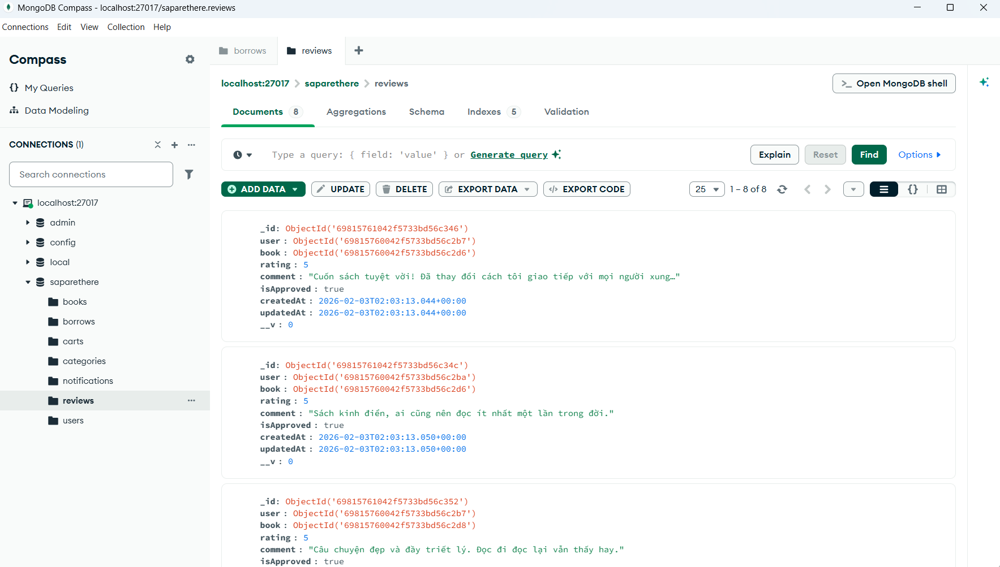
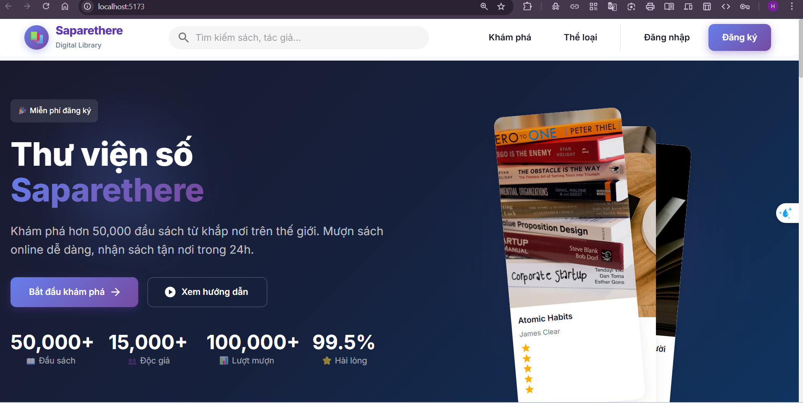
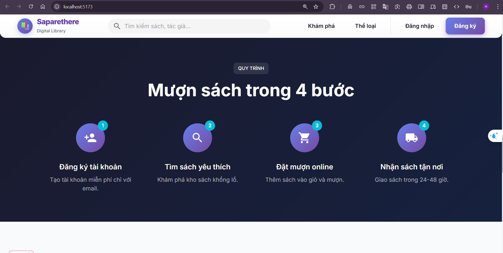
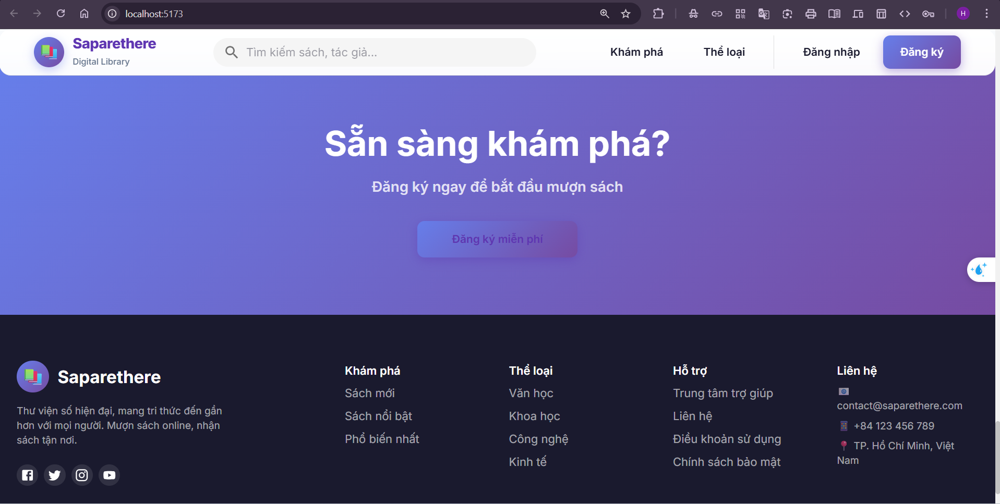
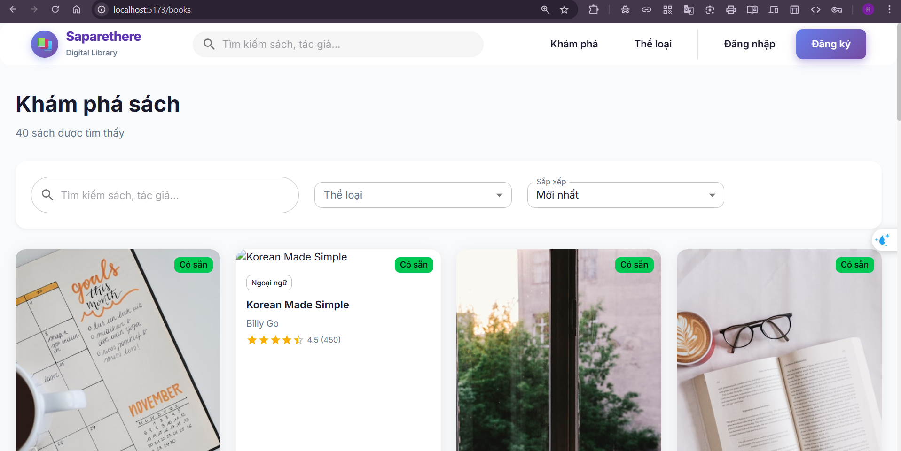
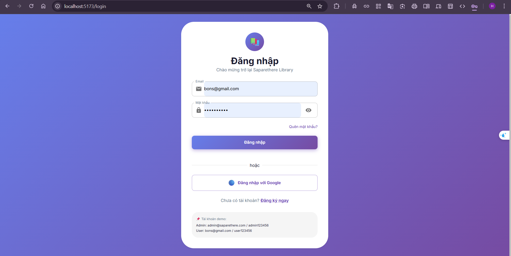
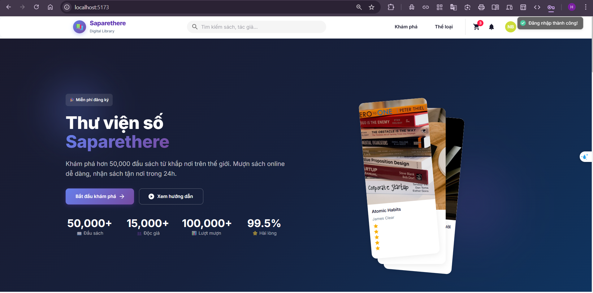
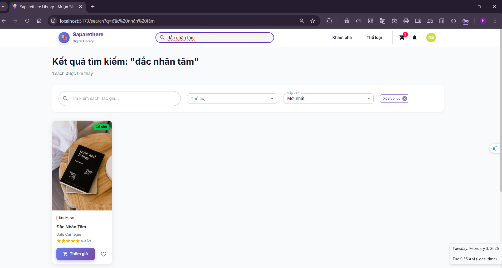
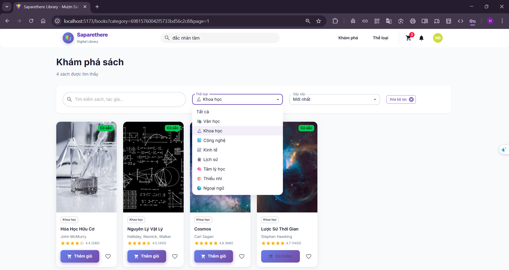
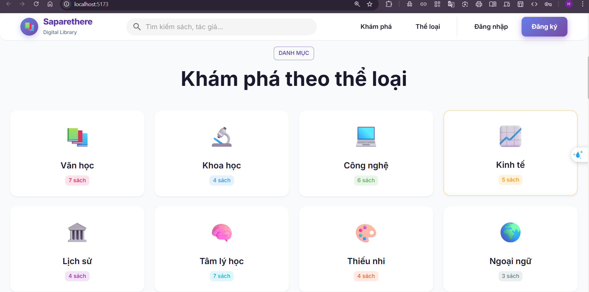

# React-MUI-NodeJS-Express-MongoDB-Library















# 📚 Saparethere Library - Full Stack Project

## 📁 Cấu trúc ban đầu khi mở VSCode

```
React+MUI+NodeJS+Express+MongoDB/
├── backend/
│   ├── src/
│   │   ├── config/
│   │   │   ├── database.js
│   │   │   └── index.js
│   │   ├── controllers/
│   │   │   ├── authController.js
│   │   │   ├── bookController.js
│   │   │   ├── borrowController.js
│   │   │   ├── cartController.js
│   │   │   ├── categoryController.js
│   │   │   ├── index.js
│   │   │   ├── notificationController.js
│   │   │   ├── reviewController.js
│   │   │   ├── statsController.js
│   │   │   └── userController.js
│   │   ├── middleware/
│   │   │   ├── admin.js
│   │   │   ├── auth.js
│   │   │   ├── errorHandler.js
│   │   │   ├── index.js
│   │   │   ├── rateLimiter.js
│   │   │   └── validate.js
│   │   ├── models/
│   │   │   ├── Book.js
│   │   │   ├── Borrow.js
│   │   │   ├── Cart.js
│   │   │   ├── Category.js
│   │   │   ├── index.js
│   │   │   ├── Notification.js
│   │   │   ├── Review.js
│   │   │   └── User.js
│   │   ├── routes/
│   │   │   ├── authRoutes.js
│   │   │   ├── bookRoutes.js
│   │   │   ├── borrowRoutes.js
│   │   │   ├── cartRoutes.js
│   │   │   ├── categoryRoutes.js
│   │   │   ├── index.js
│   │   │   ├── notificationRoutes.js
│   │   │   ├── reviewRoutes.js
│   │   │   ├── statsRoutes.js
│   │   │   └── userRoutes.js
│   │   ├── seeds/
│   │   │   ├── data/
│   │   │   │   ├── books.json
│   │   │   │   ├── categories.json
│   │   │   │   └── users.json
│   │   │   └── index.js
│   │   ├── utils/
│   │   │   ├── ApiError.js
│   │   │   ├── ApiResponse.js
│   │   │   ├── asyncHandler.js
│   │   │   ├── helpers.js
│   │   │   └── index.js
│   │   └── app.js
│   ├── .env.example
│   ├── .gitignore
│   ├── package.json
│   ├── README.md
│   └── server.js
│
└── frontend/
    ├── public/
    ├── src/
    │   ├── assets/
    │   ├── components/
    │   │   ├── books/
    │   │   ├── common/
    │   │   └── layout/
    │   ├── config/
    │   ├── context/
    │   ├── hooks/
    │   ├── pages/
    │   │   ├── admin/
    │   │   ├── auth/
    │   │   ├── errors/
    │   │   ├── public/
    │   │   └── user/
    │   ├── routes/
    │   ├── services/
    │   ├── theme/
    │   ├── utils/
    │   ├── App.jsx
    │   ├── index.css
    │   └── main.jsx
    ├── .env
    ├── .gitignore
    ├── eslint.config.js
    ├── index.html
    ├── package.json
    ├── README.md
    └── vite.config.js
```

---

## 🔧 Bước 1: Cài đặt dependencies Backend

**Mở terminal trong VSCode và chạy:**

```bash
cd backend
npm install
```

**Sau khi chạy, cấu trúc thêm:**

```
backend/
├── node_modules/        # ← MỚI SINH RA (256 packages)
├── package-lock.json    # ← MỚI SINH RA
└── ... (các file cũ)
```

---

## 🔧 Bước 2: Tạo file .env cho Backend

```bash
cp .env.example .env
```

**Sau khi chạy, cấu trúc thêm:**

```
backend/
├── .env                 # ← MỚI SINH RA (copy từ .env.example)
└── ... (các file cũ)
```

---

## 🗄️ Bước 3: Seed dữ liệu vào MongoDB

**Đảm bảo MongoDB đang chạy, sau đó:**

```bash
node src/seeds/index.js --fresh
```

**Kết quả:** Tạo database `saparethere` trong MongoDB với 7 collections

---

## 🚀 Bước 4: Chạy Backend Server

```bash
npm run dev
```

**Backend chạy tại:** `http://localhost:5000`

---

## 🔧 Bước 5: Cài đặt dependencies Frontend

**Mở terminal mới trong VSCode và chạy:**

```bash
cd frontend
npm install
```

**Sau khi chạy, cấu trúc thêm:**

```
frontend/
├── node_modules/        # ← MỚI SINH RA (hàng trăm packages)
├── package-lock.json    # ← MỚI SINH RA
└── ... (các file cũ)
```

---

## 🚀 Bước 6: Chạy Frontend Server

```bash
npm run dev
```

**Frontend chạy tại:** `http://localhost:5173`

---

## 🌐 Trải nghiệm Web

Mở trình duyệt và truy cập: **http://localhost:5173**

**Tài khoản để đăng nhập:**
- Admin: `admin@saparethere.com` / `admin123456`
- User: `bons@gmail.com` / `user123456`

---

## 📊 Cấu trúc cuối cùng sau khi chạy tất cả

```
React+MUI+NodeJS+Express+MongoDB/
├── backend/
│   ├── node_modules/         # ← Đã sinh ra
│   ├── src/
│   │   └── ... (không đổi)
│   ├── .env                  # ← Đã tạo
│   ├── .env.example
│   ├── package-lock.json     # ← Đã sinh ra
│   ├── package.json
│   ├── README.md
│   └── server.js
│
└── frontend/
    ├── node_modules/         # ← Đã sinh ra
    ├── public/
    ├── src/
    │   └── ... (không đổi)
    ├── .env
    ├── package-lock.json     # ← Đã sinh ra
    ├── package.json
    ├── README.md
    └── vite.config.js
```

---

## 📝 Tóm tắt các lệnh chạy tuần tự

```bash
# Terminal 1 - Backend
cd backend
npm install
cp .env.example .env
node src/seeds/index.js --fresh
npm run dev

# Terminal 2 - Frontend
cd frontend
npm install
npm run dev

# Truy cập: http://localhost:5173
```

